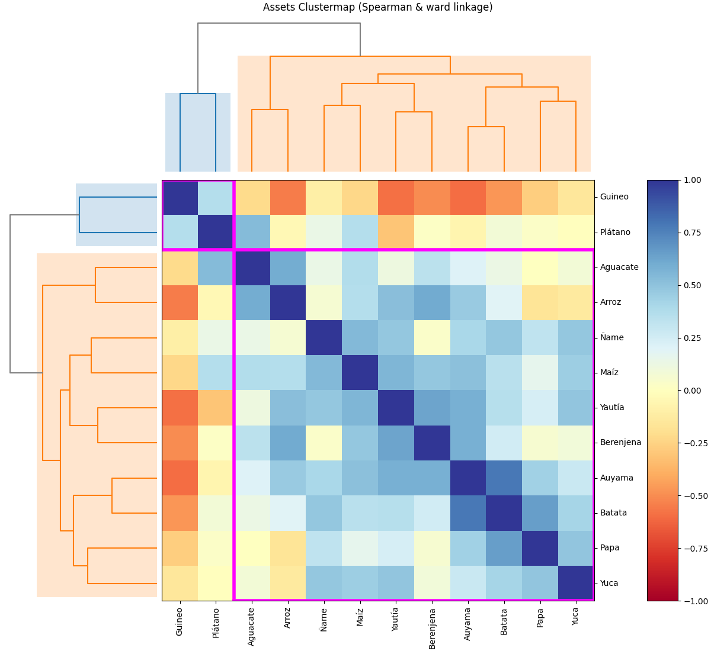
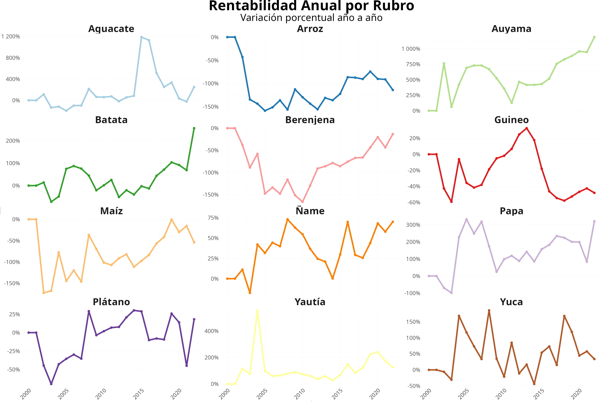
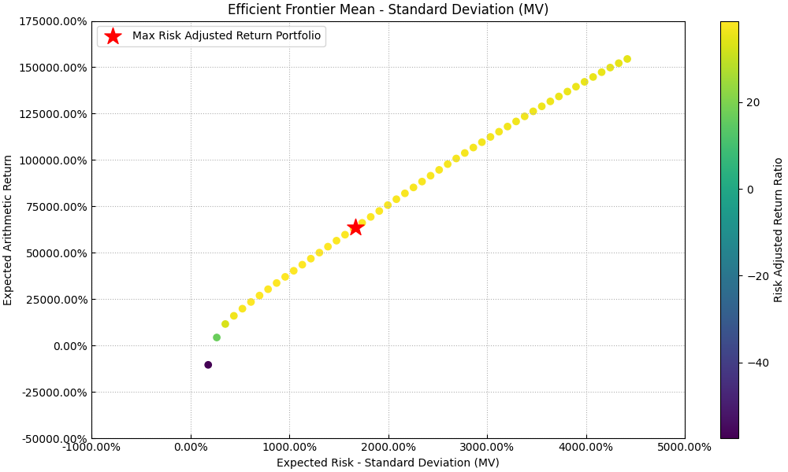
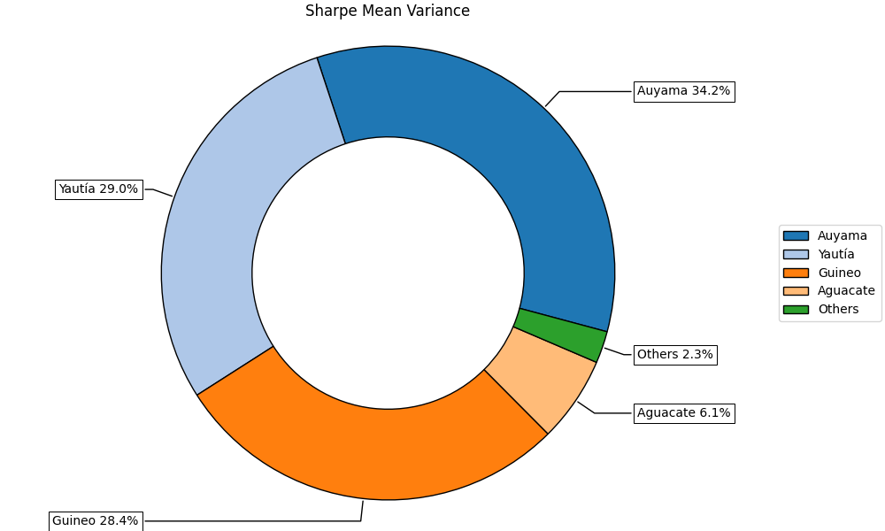
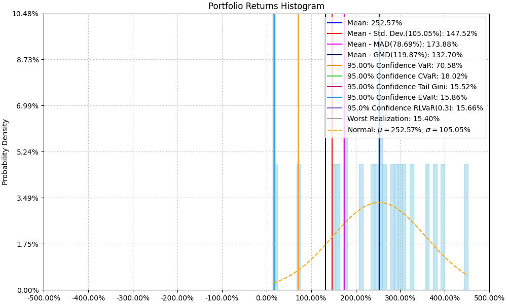
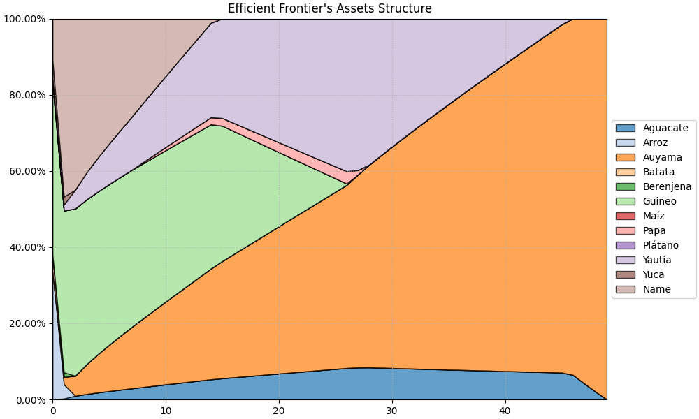
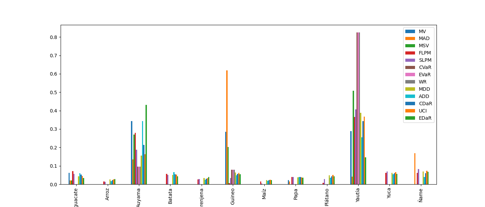

## Contexto del sector

El sector agrícola representa una pieza clave para el desarrollo económico nacional.

-   Su valor agregado representa el $3\%$ del Producto Interno Bruto.

-   Alrededor de $361,063$ personas se encuentran trabajando en este sector o en sectores relacionados.

-   Las exportaciones agrícolas representan el $6.4\%$ de las exportaciones totales.

Sin embargo, existen ineficiencias estructurales y fallas del mercado que limitan su potencial de desarrollo.

## Desafíos del sector

El sector agrícola dominicano enfrenta serios desafíos que limitan su desarrollo y crecimiento:

-   *Baja concentración en la tenencia de la tierra*. El $77\%$ de los productores operan parcelas menores a $4.5$ hectáreas, mientras que el 10% de los grandes productores: controlan el $61\%$ de la tierra agrícola.

-   *Infraestructura rural deplorable*. Sistemas de riego inadecuado, instalaciones de almacenamiento limitada, redes de transporte subdesarrollada, etc.

-   *Alta informalidad*. Esto impide que dichos productores tengan acceso al financiamiento.

-   *Cobertura limitada a riesgos climáticos*. Los seguros agropecuarios ofrecidos solo protegen a los productores ante eventualidades climáticas pero no contemplan riesgos de mercado, fluctuaciones de precios, etc.

## Riesgos del sector

El sector agrícola dominicano enfrentan riesgos de carácter multidimensional, que afecta negativamente la producción y a su vez, impactan significativamente su capacidad de competir en mercados internacionales:

-   **Los riesgos climáticos**. Huracanes, sequías e inundaciones.

-   **Riesgos de mercados**. Volatilidad en los precios de los rubros agrícolas y la desfavorables posición que poseen los productores agrícolas con los intermediarios en la cadena de valor.

-   **Exposición a riesgos biológicos**

-   **Limitado acceso a instrumentos financieros** como seguros agrícolas, contratos futuros y mecanismos de cobertura.

## Propósito y objetivo del trabajo

-   **Propósito**

Generar una metodología alternativa y de baja inversión de capital para la planificación de cultivos, que permita mitigar los riesgos inherentes del mercado y maximizar los beneficios.

-   **Objetivo**

Crear un modelo matemática de optimización que permita maximizar rendimientos ajustados por riesgos a través de la selección óptima de cultivos, mejorando la sostenibilidad del sector agrícola dominicano.

# Metodología

## Retorno Esperado del Portafolio Agrícola

* Adaptación de Teoría de Markowitz (1952) a agricultura: cada cultivo es un "activo" 

* Los rendimientos esperados son un promedio ponderado de cada cultivo individual

* La fórmula fundamental del retorno:

$$
R = \sum_{i=1}^n x_i r_i
$$

* Donde:
  - $R$ es retorno total esperado
  - $x_i$ es proporción de tierra asignada
  - $r_i$ es rendimiento individual esperado

## Riesgo y Covarianzas en Agricultura

* Riesgo medido por varianza del portafolio:

$$
\phi_{k}(w) = \sum_{i=1}^n \sum_{j=1}^n x_i x_j \sigma_{ij}
$$

* Covarianza entre cultivos:

$$
\sigma_{ij} = E[(r_i - E(r_i))(r_j - E(r_j))]
$$

* Beneficios de diversificación:
  - Cultivos con covarianza negativa reducen riesgo total
  - Permite estabilizar ingresos a lo largo del año

## Optimización del Portafolio

* Objetivo: Maximizar ratio de Sharpe

$$
\begin{aligned}
&\underset{w}{\max} & & \frac{R (w) - r_{f}}{\phi_{k}(w)}\\
&\text{s.t.} & & Aw \leq B\\
& & &\phi_{i}(w) \leq c_{i}\\
& & & R (w) \geq \overline{\mu}
\end{aligned}
$$

* Encuentra balance óptimo entre retorno y riesgo
* Considera restricciones de capacidad y riesgo máximo
* Permite adaptación dinámica a condiciones de mercado

## Matríz técnica para el cálculo de la rentabilidad por rubro Agrícola

Para el cálculo de los rendimientos, se emplea la siguiente formula:

$$
\frac{\text{Productividad} \cdot \text{Precio} - \text{costo}}{\text{costo}} \cdot (\text{ciclo})
$$

-   Productividad promedio anual (kg/ha).

-   Precio recibido por el productor (RD\$/kg).

-   Costos totales de producción.

-   Ciclo de cosecha del cultivo.

**Ventajas**: Metodología adaptable a cualquier escala productiva que facilita comparaciones estandarizadas entre cultivos, independientemente de su ciclo o capital requerido.

# Análisis exploratorio de data

## Datos 

* Análisis basado en 12 cultivos principales en República Dominicana durante 2002T1-2022T1 (20 años de datos trimestrales)

* Cultivos seleccionados: arroz, maíz, papa blanca, batata, yautía blanca, ñame, berenjena criolla, auyama, aguacate, guineo verde y plátano

* Criterios de selección:
  - Alta disponibilidad de datos históricos de rendimientos y costos
  - Relevancia significativa en la dieta dominicana local

* Datos diseñados para asegurar aplicabilidad práctica y representatividad estadística

## Análisis de la matriz de correlación de la rentabilidad de los rubros

{#fig-cluster}

## Análisis exploratorio de los rendimientos de los rubros agrícolas



{#fig-profit_by_crop}

# Resultados

## La Frontera Eficiente del Portafolio Agrícola

{#fig-efficient-frontier-plot}

## Composición del Portafolio Óptimo

{#fig-pie-plot}

## Estadísticas descriptivas del portafolio óptimo

{#fig-histogram}

## La composición ante variaciones de la varianza deseada

{#fig-efficient-frontier-by-risk}

## La composición ante diferentes metodologías de medición de riesgo. 

{#fig-wheights-by-risk-metric-plot}

## Conclusiones 

+ La aplicación de la TPM en agricultura dominicana demuestra ser efectiva para optimizar selección de cultivos, logrando un ratio Sharpe de $2.40$

+ El portafolio óptimo se compone de: Auyama $34.2\%$, Yautía $29.0\%$, Guineo $28.4\%$, Aguacate $6.1\%$.

+ La metodología ofrece protección contra pérdidas extremas: VaR del $70.58\%$ y CVaR del $18.02\%$

+ La estructura es adaptable a diferentes perfiles de riesgo del agricultor

+ Logra mejora significativa sin requerir inversiones adicionales o cambios estructurales

## Referencias

::: {#refs}
:::